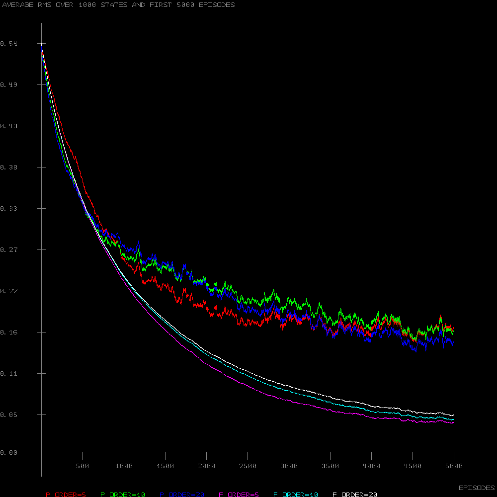

# Function Approximation: Random Walk 1000

<b>Chapter 9: Reinforcement Learning: An Introduction(2nd edition) by Sutton &amp; Barto</b>

This is reporoduction of figures from the book. The intervals for Coarse Coding are randomly spread through the region of the Square Wave function. Bitmap is implemented in pure Lua and is very slow!

Approximation by Monte Carlo using State Aggregation:

Approximation by TD(0) using State Aggregation:

.bmp)

Comparison of TD algorithms with different step size N. This picture is with ACTIONS to left and right up to 50 states:

This one is with ACTIONS to left and right up to 100 states

Comparison of basises during learning - Polynomial VS Fourier:

Comparison of Tile coding using 50 tiles VS 1-tile/no-tiling(which is equivalent to State Aggregation). Note that I run it for 10,000 episodes since 5,000 for me were not enough to outpeform the no-tiling:

